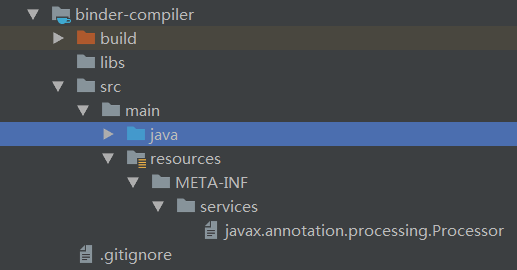
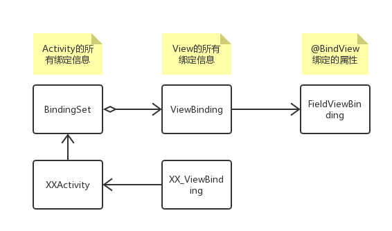

### 什么是APT？

引用官方文档的描述
> The command-line utility apt, annotation processing tool, finds and executes annotation processors based on the annotations present in the set of specified source files being examined. The annotation processors use a set of reflective APIs and supporting infrastructure to perform their processing of program annotations (JSR 175). The apt reflective APIs provide a build-time, source-based, read-only view of program structure. These reflective APIs are designed to cleanly model the JavaTM programming language's type system after the addition of generics (JSR 14). First, apt runs annotation processors that can produce new source code and other files. Next, apt can cause compilation of both original and generated source files, thus easing the development cycle.

简单来说，APT是一种注解处理工具，它会根据源文件中存在的注释，查找并执行注解处理器。执行注解处理器时，可以生成新的源代码文件和其他文件。APT还会编译原有的源文件和生成的源文件。

APT会在编译期解析注解。所以很多第三方库，如`Dagger2`，`ButterKnife`，`EventBus3`等都使用APT来实现相关功能。

如果对`Annotation`还不是很了解的话，可以看看这个图


接下来会实现一个类似`ButterKnife`功能的项目`ViewBinder`，通过实现`@BindView`注解来学习APT

### 项目结构
参考`ButterKnife`的模块划分，新建`ViewBinder`项目，然后新建如下模块：

* `binder` - Android Library，存放对外使用的API
* `binder-annotations` - Java Library，存放注解
* `binder-compiler` - Java Library，存放注解处理器

模块间的依赖关系：

* `binder-compiler` 依赖 `binder-annotations`

### 创建注解
`@BindView`用于成员变量，并且需要接收一个id作为参数，用于绑定`View`。

```Java
@Retention(RetentionPolicy.CLASS)
@Target(ElementType.FIELD)
public @interface BindView {

    int value();
}
```

### 创建注解处理器
创建一个`AbstractProcessor`的子类，并重写相关方法
```Java
public class BinderProcessor extends AbstractProcessor {
    private Filer mFiler; //文件相关的辅助类，生成JavaSourceCode
    private Elements mElementUtils; //元素相关的辅助类，帮助我们去获取一些元素相关的信息
    private Messager mMessager; //日志相关的辅助类

    @Override
    public synchronized void init(ProcessingEnvironment env) {
        super.init(env);
        mFiler = env.getFiler();
        mElementUtils = env.getElementUtils();
        mMessager = env.getMessager();
    }

    @Override
    public Set<String> getSupportedAnnotationTypes() {
        Set<String> types = new LinkedHashSet<>();
        types.add(BindView.class.getCanonicalName());
        return types;
    }

    @Override
    public SourceVersion getSupportedSourceVersion() {
        return SourceVersion.latestSupported();
    }

    @Override
    public boolean process(Set<? extends TypeElement> set, RoundEnvironment env) {
        return false;
    }
}
```
所有的注解处理器类都必须有一个无参构造函数。因为APT是通过SPI(Service Provider Interfaces)机制，借助`Serviceloader`读取`META-INF/services`下的配置文件，然后利用反射调用无参构造函数来加载注解处理器的

下面介绍下`AbstractProcessor`几个常用的方法：

* `init(ProcessingEnvironment env)`：初始化方法，可以在此获取一些工具类：
    * `Filer`：文件相关的辅助类，生成JavaSourceCode
    * `Elements`：元素相关的辅助类，帮助我们去获取一些元素相关的信息
    * `Messager`：日志相关的辅助类
* `getSupportedAnnotationTypes()`：指定需要被注解处理器注册的注解，即需要处理哪些注解。返回的集合里面是注解类型的全称。
* `getSupportedSourceVersion()`：指定使用的Java版本。通常返回SourceVersion.latestSupported()
* `process(Set<? extends TypeElement> set, RoundEnvironment env)`：最重要的方法。在这个方法里可以对注解进行处理，并生成相应的文件。

另外，如果注解处理器类生成了新的源文件，APT会重复调用注解处理器的方法，直到不再生成新的源文件为止（因为新生成的源文件可能会包含需要被处理的注解）

#### 如何编译注解处理器?
方法一：  
在Gradle Project面板中，依次选择binder-compiler -> Tasks -> build -> build，双击运行即可

方法二：  
在命令行执行
```
gradlew binder-compiler:build
```

#### 遇到的问题
错误: 编码GBK的不可映射字符  

解决方法：  
在`binder-compiler`的build.gradle文件中，增加
```
tasks.withType(JavaCompile) {
    options.encoding = "UTF-8"
}
```
然后重新sync一下即可

### 注册注解处理器
前面说了，APT是通过SPI来加载注解处理器的，所以使用SPI的方式注册即可

方法一：  
在`binder-compiler`中的/src/main/文件夹下，新建resources/META-INF/services/文件夹，然后创建一个名为`javax.annotation.processing.Processor`的文件。文件内容为
```
com.benio.binder.compiler.BinderProcessor
```
注意：目录结构和文件名是固定的，文件内容是注解处理器的全称



方法二：  
使用Google的[AutoService](https://github.com/google/auto/tree/master/service)。用`AutoService`对注解处理器进行标记
```Java
@AutoService(Processor.class)
public class BinderProcessor extends AbstractProcessor {
    ...
}
```
标记后再build一下，`AutoService`就会自动生成方法一里面的`javax.annotation.processing.Processor`文件

### 实现注解处理器的process
process()方法里面做的事情有两个：

* 收集被注解的`Element`的信息
* 生成用于绑定的类，这里我把这些类命名为`ViewBinding`类

这里简单介绍下`Element`的几种类型：

* `VariableElement`：一般代表成员变量
* `ExecutableElement`：一般代表类中的方法
* `TypeElement`：一般代表代表类
* `PackageElement`：一般代表Package

#### 类的设计

每个`Activity`将生成一个`ViewBinding`类。如`MainActivity`将生成`MainActivity_ViewBinding`。我们的目标是要生成这样一个类
```Java
public class MainActivity_ViewBinding {
  public static void bind(final MainActivity target) {
    target.mTitleView = (TextView)target.findViewById(R.id.title);
    target.mImageView = (ImageView)target.findViewById(R.id.image);
  }
}
```
收集`Activity`中使用了`@BindView`的属性的信息，如属性名，类型等，并将收集的信息包装成类。这里参考了`ButterKnife`的类设计



```Java
final class FieldViewBinding {
    // 变量名
    private final String name;
    // 类型
    private final TypeName type;

    FieldViewBinding(String name, TypeName type) {
        this.name = name;
        this.type = type;
    }
    // 省略getter方法
}

final class ViewBinding {
    // view id
    private final int id;
    // id对应绑定的变量，可为空
    private FieldViewBinding fieldBinding;

    public ViewBinding(int id) {
        this.id = id;
    }
    // 省略getter setter方法
}

class BindingSet {
    // 绑定的类
    private final TypeName targetTypeName;
    // 生成的类
    private final ClassName bindingClassName;
    private Map<Integer, ViewBinding> viewIdMap = new LinkedHashMap<>();

    public BindingSet(TypeName targetTypeName, ClassName bindingClassName) {
        this.targetTypeName = targetTypeName;
        this.bindingClassName = bindingClassName;
    }

    public void addField(int id, FieldViewBinding fieldBinding) {
        getOrCreateViewBinding(id).setFieldBinding(fieldBinding);
    }
    // 省略部分方法
}
```

#### 收集信息
类设计好了，开始收集信息了
```Java
    private Map<TypeElement, BindingSet> findAndParseTargets(RoundEnvironment env) {
        Map<TypeElement, BindingSet> bindingMap = new LinkedHashMap<>();

        for (Element element : env.getElementsAnnotatedWith(BindView.class)) {
            try {
                parseBindView(element, bindingMap);
            } catch (Exception e) {
                logParsingError(element, BindView.class, e);
            }
        }

        return bindingMap;
    }

    private void parseBindView(Element element, Map<TypeElement, BindingSet> bindingMap) {
        // 属性所在的类
        TypeElement enclosingElement = (TypeElement) element.getEnclosingElement();
        // 绑定的id
        int id = element.getAnnotation(BindView.class).value();
        // 变量名
        String name = element.getSimpleName().toString();
        // 变量类型
        TypeName type = TypeName.get(element.asType());

        BindingSet bindingSet = getOrCreateBindingSet(bindingMap, enclosingElement);
        bindingSet.addField(id, new FieldViewBinding(name, type));
    }
```
通过`env.getElementsAnnotatedWith(BindView.class)`，获取含`@BindView`注解的元素集合。遍历元素集合，获取元素的信息，并添加到`BindingSet`中。那`getOrCreateBindingSet()`到底做了什么

```Java
    private BindingSet getOrCreateBindingSet(Map<TypeElement, BindingSet> bindingMap,
                                             TypeElement enclosingElement) {
        BindingSet bindingSet = bindingMap.get(enclosingElement);
        if (bindingSet == null) {
            TypeMirror typeMirror = enclosingElement.asType();
            // 绑定的类
            TypeName targetType = TypeName.get(typeMirror);

            String packageName = mElementUtils.getPackageOf(enclosingElement).getQualifiedName().toString();
            String className = enclosingElement.getQualifiedName().toString().substring(
                    packageName.length() + 1).replace('.', '$');
            // 生成的类
            ClassName bindingClassName = ClassName.get(packageName, className + "_ViewBinding");

            bindingSet = new BindingSet(targetType, bindingClassName);
            bindingMap.put(enclosingElement, bindingSet);
        }
        return bindingSet;
    }
```
根据`enclosingElement`，检查`bindingMap`中对应的值是否为空。非空直接返回，空则创建并添加到`bindingMap`中。那这个`enclosingElement`是什么鬼？其实就是`@BindView`绑定的属性所在的类，也就是我们的`Activity`。

从`enclosingElement`中，我们获取到其对应的`TypeName`，还拼接出表示要生成的`ViewBinding`类的`ClassName`。这个`ViewBinding`将会与`Activity`同在一个package下，并且命名为`ActivityClassName_ViewBinding`

#### 生成代码
信息收集完毕，开始生成`ViewBinding`类。这里要使用到[JavaPoet](https://github.com/square/javapoet)，所以要在`binder-compiler`的build.gradle文件中添加依赖
```Groovy
dependencies {
    implementation project(':binder-annotations')
    implementation 'com.squareup:javapoet:1.11.1'
}
```
对`JavaPoet`不熟悉的话也没关系，边写边看就好了

```Java
class BindingSet {
    // 绑定的类
    private final TypeName targetTypeName;
    // 生成的类
    private final ClassName bindingClassName;
    private Map<Integer, ViewBinding> viewIdMap = new LinkedHashMap<>();
    // 省略部分代码

    JavaFile brewJava() {
        TypeSpec bindingConfiguration = createType();
        return JavaFile.builder(bindingClassName.packageName(), bindingConfiguration)
                .addFileComment("Generated code from ViewBinder. Do not modify!")
                .build();
    }

    private TypeSpec createType() {
        // public class MainActivity_ViewBinding
        TypeSpec.Builder result = TypeSpec.classBuilder(bindingClassName.simpleName())
                .addModifiers(Modifier.PUBLIC);

        // public static void bind(MainActivity target)
        MethodSpec.Builder methodBuilder = MethodSpec.methodBuilder("bind")
                .addModifiers(Modifier.PUBLIC, Modifier.STATIC)
                .returns(void.class)
                .addParameter(targetTypeName, "target", Modifier.FINAL);

        Collection<ViewBinding> viewBindings = Collections.unmodifiableCollection(viewIdMap.values());
        for (ViewBinding viewBinding : viewBindings) {
            FieldViewBinding fieldBinding = viewBinding.getFieldBinding();
            if (fieldBinding != null) {
                // target.title = (TextView)target.findViewById(R.id.title);
                methodBuilder.addStatement("target.$L = ($T)target.findViewById($L)",
                        fieldBinding.getName(), fieldBinding.getType(), viewBinding.getId());
            }
        }

        result.addMethod(methodBuilder.build());
        return result.build();
    }
}
```
将我们前面收集的信息，结合`JavaPoet`生成`ViewBiding`类。这部分代码和生成的代码对比着看比较好理解

```Java
public class MainActivity_ViewBinding {
  public static void bind(final MainActivity target) {
    target.mTitleView = (TextView)target.findViewById(2131165318);
    target.mImageView = (ImageView)target.findViewById(2131165253);
  }
}
```
最后只需在process方法中，调用相关方法即可自动生成`ViewBiding`类

```Java
    @Override
    public boolean process(Set<? extends TypeElement> set, RoundEnvironment env) {
        Map<TypeElement, BindingSet> bindingMap = findAndParseTargets(env);
        for (Map.Entry<TypeElement, BindingSet> entry : bindingMap.entrySet()) {
            TypeElement typeElement = entry.getKey();
            BindingSet bindingSet = entry.getValue();
            try {
                bindingSet.brewJava().writeTo(mFiler);
            } catch (IOException e) {
                error(typeElement, "Unable to write binding for type %s: %s", typeElement, e.getMessage());
            }
        }
        return true;
    }
```

### API模块的实现
参考`ButterKnife`的API，创建一个`ViewBinder`类。提供对外使用的API
```
ViewBinder.bind(activity)
```
这个方法里面需要做的事就两个：

* 根据传入的`Activity`寻找对应的`ViewBinding`类
* 调用`MainActivity_ViewBinding`的`bind`方法

考虑到反射性能的问题，所以一般会加上缓存处理
```Java
public final class ViewBinder {
    static final Map<Class<?>, Method> BINDINGS = new LinkedHashMap<>();

    public static void bind(Activity target) {
        Class<?> targetClass = target.getClass();
        Method method = findBindingMethodForClass(targetClass);
        try {
            method.invoke(null, target);
        } catch (IllegalAccessException e) {
            e.printStackTrace();
        } catch (InvocationTargetException e) {
            e.printStackTrace();
        }
    }

    private static Method findBindingMethodForClass(Class<?> cls) {
        Method bindingMethod = BINDINGS.get(cls);
        if (bindingMethod != null || BINDINGS.containsKey(cls)) {
            return bindingMethod;
        }
        String clsName = cls.getName();
        try {
            Class<?> bindingClass = cls.getClassLoader().loadClass(clsName + "_ViewBinding");
            bindingMethod = bindingClass.getMethod("bind", cls);
        } catch (ClassNotFoundException e) {
            e.printStackTrace();
        } catch (NoSuchMethodException e) {
            e.printStackTrace();
        }
        BINDINGS.put(cls, bindingMethod);
        return bindingMethod;
    }
}
```

### 参考

* [Getting Started with the Annotation Processing Tool, apt](https://docs.oracle.com/javase/7/docs/technotes/guides/apt/GettingStarted.html)
* [Android 利用 APT 技术在编译期生成代码](https://brucezz.itscoder.com/use-apt-in-android)
* [Android 如何编写基于编译时注解的项目](https://blog.csdn.net/lmj623565791/article/details/51931859)
* [JavaPoet](https://github.com/square/javapoet)
* [ButterKnife](https://github.com/JakeWharton/butterknife)