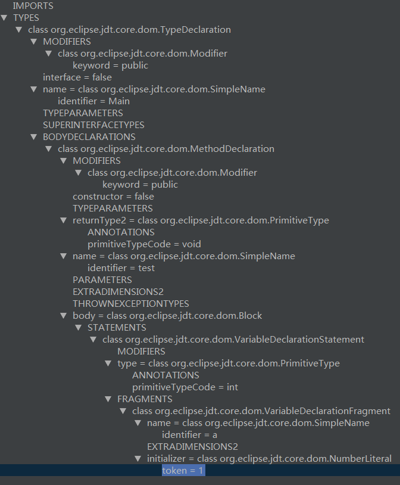
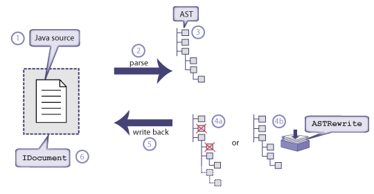

### 什么是AST？

引用[Wikipedia](https://en.wikipedia.org/wiki/Abstract_syntax_tree)的描述
> In computer science, an abstract syntax tree (AST), or just syntax tree, is a tree representation of the abstract syntactic structure of source code written in a programming language. Each node of the tree denotes a construct occurring in the source code. The syntax is "abstract" in the sense that it does not represent every detail appearing in the real syntax, but rather just the structural, content-related details. 

抽象语法树（AST），或者语法树，是源代码的抽象语法结构的树状表现形式。语法树中每个节点都代表源代码里的一个结构。抽象语法树并不代表真实语法中出现的每个细节，仅表示对结构和相关内容细节的描述。

AST和XML的DOM模型类似。跟DOM一样，AST允许修改树模型并在Java源代码中反映这些修改。

常见用途

* 代码语法检查
* 代码格式化
* 代码自动补全
* 代码混淆压缩

### 查看AST
* [JDT AstView](https://plugins.jetbrains.com/plugin/9345-jdt-astview)：IntelliJ安装`JDT AstView`插件后，右键选择`Enable JDT AST View`，即可以查看AST。示例代码以及对应的AST
```Java
public class Main{
    public void test(){
        int a = 1;
    }
}
```

* [ASTExplorer](https://astexplorer.net/)：可以在线看到不同的parser解析js代码后得到的AST
* [js-code-to-svg-flowchart](https://github.com/Bogdan-Lyashenko/js-code-to-svg-flowchart)：非常有意思的项目

### 如何利用AST？
AST定义了代码的结构。通过操作AST，我们可以精准地定位到声明语句、赋值语句、运算语句等，实现对源代码的分析、优化、变更等操作。

使用AST的应用程序的工作流程如下：



Java提供了获取AST的方式，就是注解处理器（APT）。

### 实践
接下来会利用AST实现清除`Log`的功能。

#### 项目结构
新建如下模块：

* ast-sample - Android Library，存放测试用例
* ast-compiler - Java Library，存放注解处理器

#### 创建注解处理器
创建一个AbstractProcessor的子类，并重写相关方法
```Java
public class ClearLogProcessor extends AbstractProcessor {
    @Override
    public Set<String> getSupportedAnnotationTypes() {
        Set<String> types = new LinkedHashSet<>();
        types.add("*");
        return types;
    }

    @Override
    public SourceVersion getSupportedSourceVersion() {
        return SourceVersion.latestSupported();
    }

    @Override
    public boolean process(Set<? extends TypeElement> set, RoundEnvironment roundEnvironment) {
        return false;
    }
}
```
`getSupportedAnnotationTypes`返回`*`，指定所有注解类型

#### 注册注解处理器
新建`src/main/resources/META-INF/services/javax.annotation.processing.Processor`文件，文件内容为注解处理器的全称
```
com.benio.ast.compiler.ClearLogProcessor
```

#### 获取AST
通过`Trees.instance(env)`方法获取
```Java
public class ClearLogProcessor extends AbstractProcessor {
    private Trees mTrees;// 抽象语法树

    @Override
    public synchronized void init(ProcessingEnvironment env) {
        super.init(env);
        mTrees = Trees.instance(env);
    }
}
```

#### 修改AST
在注解处理器的process函数中，扫描所有类，实现一个自定义的`TreeTranslator`

```Java
public class ClearLogProcessor extends AbstractProcessor {
    private static final List<String> LOG_TAGS = Arrays.asList("Log.", "Logger.");

    @Override
    public boolean process(Set<? extends TypeElement> set, RoundEnvironment roundEnvironment) {
        for (Element element : roundEnvironment.getRootElements()) {
            // 粒度为类
            if (element.getKind() == ElementKind.CLASS) {
                TreeTranslator translator = new JCStatementFilter() {
                    @Override
                    protected boolean accepts(JCTree.JCBlock jcBlock, JCTree.JCStatement statement) {
                        // 判断是否为Log语句
                        for (String tag : LOG_TAGS) {
                            if (statement.toString().contains(tag)) {
                                return false;
                            }
                        }
                        return true;
                    }
                };
                JCTree jcTree = (JCTree) mTrees.getTree(element);
                jcTree.accept(translator);
            }
        }
        return true;
    }
}

public abstract class JCStatementFilter extends TreeTranslator {

    @Override
    public final void visitBlock(JCTree.JCBlock jcBlock) {
        super.visitBlock(jcBlock);
        // 获取"{ }"里面的语句
        List<JCTree.JCStatement> statements = jcBlock.stats;
        if (statements == null || statements.isEmpty()) {
            return;
        }
        // 这里的List不是我们一向使用的List
        List<JCTree.JCStatement> stats = List.nil();
        for (JCTree.JCStatement statement : statements) {
            if (accepts(jcBlock, statement)) {
                stats = stats.append(statement);
            }
        }
        jcBlock.stats = stats;
    }

    protected abstract boolean accepts(JCTree.JCBlock jcBlock, JCTree.JCStatement statement);
}
```

#### 测试

需要注意的是，如果是
```Java
if (DEBUG) Log.d(TAG, "onResume: ");
```
这种形式虽然等价于
```Java
if (DEBUG) {
    Log.d(TAG, "onResume: ");
}
```
但上面那种是不包含任何block的

### 参考

* [AOP 最后一块拼图 | AST 抽象语法树 —— 最轻量级的AOP方法](https://www.jianshu.com/p/0f1c7b3e907f)
* [安卓AOP之AST:抽象语法树](https://www.jianshu.com/p/5514cf705666)
* [Java代码编译过程简述](https://blog.csdn.net/fuzhongmin05/article/details/54880257)
* [Changing Java 8 – handling nulls with the AST](https://chariotsolutions.com/blog/post/changing-java-8-handling-nulls-ast/)